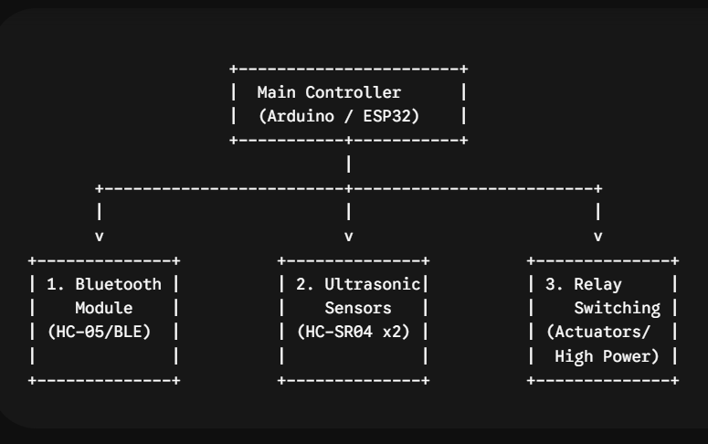

# Visual-IP-Enable-Remote-Striker-VIPER-
C++ firmware for a Wireless IP-Enabled robotic missile launcher. Features real-time video streaming via ESP32-CAM and a custom web-based control dashboard for tactical remote intervention

##images 

##code
/*
  VIPER - Visual IP-Enabled Remote Striker (Ishan Sai's)
  Features:
  1. Bluetooth RC Car Control (Serial communication via HC-05/HC-06)
  2. Dual Ultrasonic Distance Sensors (Obstacle detection & safety override)
  3. Relay-Based Switching (Control for high-power payloads/striker mechanisms)
  
  Target Platform: Arduino Uno / Mega / ESP32 (Pin adjustments may be needed)
*/

// ==========================================
// PIN CONFIGURATIONS
// ==========================================

// Motor Driver Pins (L298N / L293D)
const int motorIn1 = 2;
const int motorIn2 = 3;
const int motorIn3 = 4;
const int motorIn4 = 5;

// Ultrasonic Sensor 1 (Front)
const int trigPinFront = 6;
const int echoPinFront = 7;

// Ultrasonic Sensor 2 (Rear)
const int trigPinRear = 8;
const int echoPinRear = 9;

// Relay Switch Pin
const int relayPin = 10;

// ==========================================
// GLOBAL VARIABLES & THRESHOLDS
// ==========================================
const int SAFETY_DISTANCE_CM = 20; // Stop car if obstacle is closer than 20cm
char currentCommand = 'S';          // Stores incoming Bluetooth command

// Non-blocking timer variables for Ultrasonic Sensors
unsigned long previousMillis = 0;
const long sensorInterval = 100;    // Read sensors every 100ms

long durationFront, distanceFront;
long durationRear, distanceRear;

// ==========================================
// SETUP FUNCTION
// ==========================================
void setup() {
  // Initialize Serial Monitoring & Bluetooth (Shared Hardware/Software Serial)
  Serial.begin(9600); 

  // Initialize Motor Driver Pins
  pinMode(motorIn1, OUTPUT);
  pinMode(motorIn2, OUTPUT);
  pinMode(motorIn3, OUTPUT);
  pinMode(motorIn4, OUTPUT);

  // Initialize Ultrasonic Sensor Pins
  pinMode(trigPinFront, OUTPUT);
  pinMode(echoPinFront, INPUT);
  pinMode(trigPinRear, OUTPUT);
  pinMode(echoPinRear, INPUT);

  // Initialize Relay Pin (Active LOW or HIGH depending on your relay module)
  pinMode(relayPin, OUTPUT);
  digitalWrite(relayPin, LOW); // Start with relay turned OFF

  // Ensure car is stopped initially
  stopCar();
}

// ==========================================
// MAIN LOOP
// ==========================================
void loop() {
  unsigned long currentMillis = millis();

  // 1. Non-blocking sensor read routine
  if (currentMillis - previousMillis >= sensorInterval) {
    previousMillis = currentMillis;
    readUltrasonicSensors();
  }

  // 2. Read incoming Bluetooth commands
  if (Serial.available() > 0) {
    currentCommand = Serial.read();
    executeCommand(currentCommand);
  }

  // 3. Automatic Safety Override Checks
  // If moving forward but front obstacle detected -> Force Stop
  if (currentCommand == 'F' && distanceFront <= SAFETY_DISTANCE_CM && distanceFront > 0) {
    stopCar();
  }
  // If moving backward but rear obstacle detected -> Force Stop
  if (currentCommand == 'B' && distanceRear <= SAFETY_DISTANCE_CM && distanceRear > 0) {
    stopCar();
  }
}

// ==========================================
// COMPONENT FUNCTIONS
// ==========================================

// Function to read data from both ultrasonic sensors
void readUltrasonicSensors() {
  // Read Front Sensor
  digitalWrite(trigPinFront, LOW);
  delayMicroseconds(2);
  digitalWrite(trigPinFront, HIGH);
  delayMicroseconds(10);
  digitalWrite(trigPinFront, LOW);
  durationFront = pulseIn(echoPinFront, HIGH, 30000); // 30ms timeout
  distanceFront = durationFront * 0.034 / 2;

  // Read Rear Sensor
  digitalWrite(trigPinRear, LOW);
  delayMicroseconds(2);
  digitalWrite(trigPinRear, HIGH);
  delayMicroseconds(10);
  digitalWrite(trigPinRear, LOW);
  durationRear = pulseIn(echoPinRear, HIGH, 30000);   // 30ms timeout
  distanceRear = durationRear * 0.034 / 2;
}

// Function to handle Bluetooth command map
void executeCommand(char cmd) {
  switch (cmd) {
    // --- Movement Controls ---
    case 'F': // Move Forward (Only if path is clear)
      if (distanceFront > SAFETY_DISTANCE_CM || distanceFront == 0) moveForward();
      else stopCar();
      break;
    case 'B': // Move Backward (Only if path is clear)
      if (distanceRear > SAFETY_DISTANCE_CM || distanceRear == 0) moveBackward();
      else stopCar();
      break;
    case 'L': // Turn Left
      turnLeft();
      break;
    case 'R': // Turn Right
      turnRight();
      break;
    case 'S': // Stop Vehicle
      stopCar();
      break;

    // --- Relay Controls ---
    case 'X': // Turn Relay ON (Payload/Striker active)
      digitalWrite(relayPin, HIGH);
      break;
    case 'x': // Turn Relay OFF (Payload/Striker inactive)
      digitalWrite(relayPin, LOW);
      break;

    default:
      break;
  }
}

// --- Motor Movement Primitives ---
void moveForward() {
  digitalWrite(motorIn1, HIGH);
  digitalWrite(motorIn2, LOW);
  digitalWrite(motorIn3, HIGH);
  digitalWrite(motorIn4, LOW);
}

void moveBackward() {
  digitalWrite(motorIn1, LOW);
  digitalWrite(motorIn2, HIGH);
  digitalWrite(motorIn3, LOW);
  digitalWrite(motorIn4, HIGH);
}

void turnLeft() {
  digitalWrite(motorIn1, LOW);
  digitalWrite(motorIn2, HIGH);
  digitalWrite(motorIn3, HIGH);
  digitalWrite(motorIn4, LOW);
}

void turnRight() {
  digitalWrite(motorIn1, HIGH);
  digitalWrite(motorIn2, LOW);
  digitalWrite(motorIn3, LOW);
  digitalWrite(motorIn4, HIGH);
}

void stopCar() {
  digitalWrite(motorIn1, LOW);
  digitalWrite(motorIn2, LOW);
  digitalWrite(motorIn3, LOW);
  digitalWrite(motorIn4, LOW);
}

