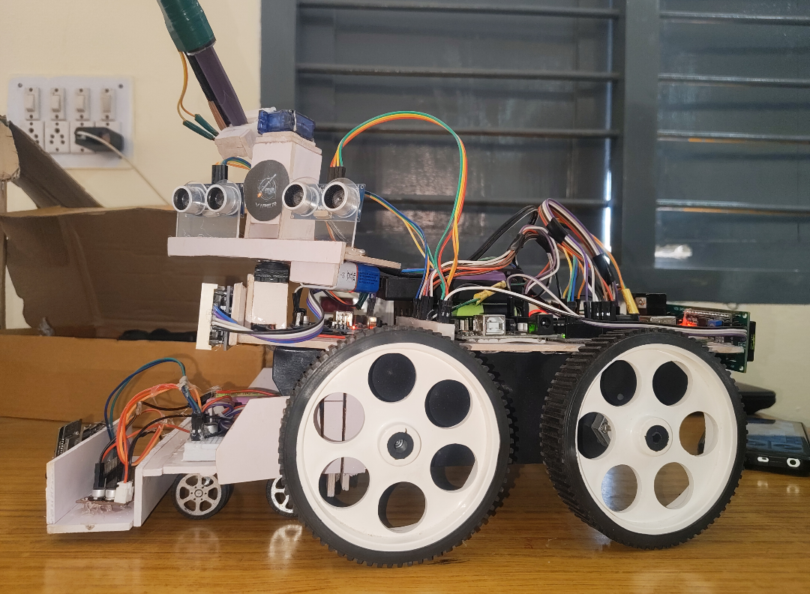
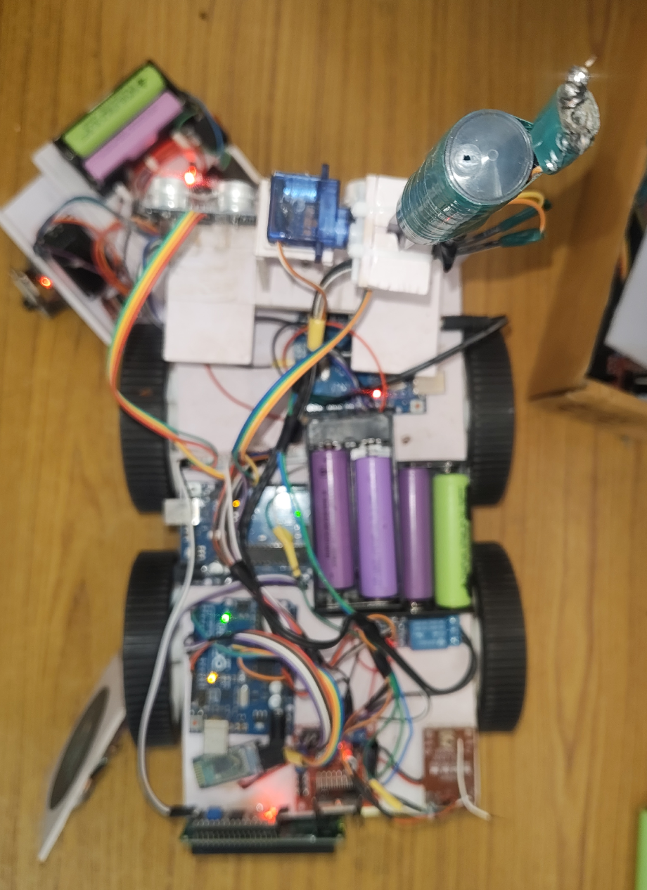

## 🚀 Advanced Features (Hardware Verified)

* **Visual IP Tracking (FPV):** Integrated front-mounted **ESP32-CAM** streaming low-latency video over a local web server for precise remote navigation and tactical monitoring.
* **Dual-Ultrasonic Hazard Matrix:** Twin forward-facing ultrasonic sensors configured for wide-angle proximity mapping and emergency safety braking.
* **Dynamic LED Telemetry:** A front-facing **MAX7219 Dot Matrix Display** providing real-time scrolling visual telemetry, system status updates, and boot diagnostics.
* **Servo-Actuated Striker:** A top-tier micro-servo mechanic enabling precise directional aiming or mechanical triggering of the auxiliary payload.
* **Non-Blocking Control Architecture:** Hardcoded entirely via asynchronous timing loops (`millis()`), allowing simultaneous video streaming, LED matrix scrolling, sensor feedback, and motor actuation without thread-locking lag.
* 
## Block Diagram 

## Images 

